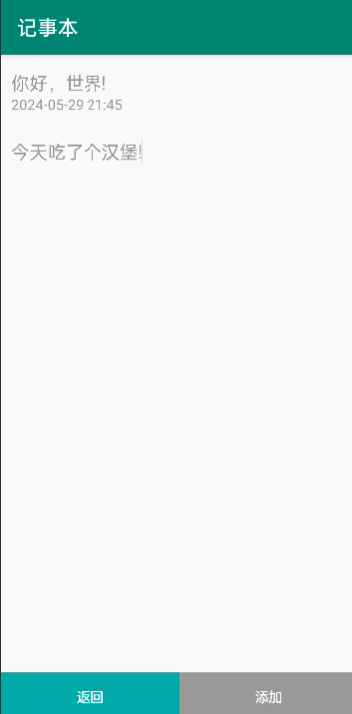
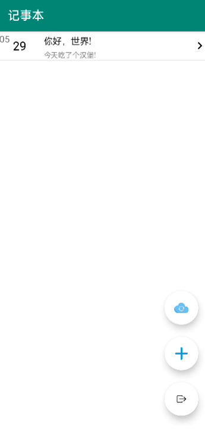
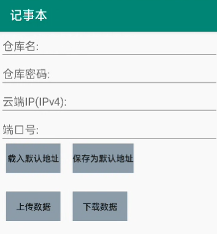

# Android-Note

以Android为前端，python为后端的备忘录程序。
数据库为Sqlite。

## 功能

1.用户可以新加，修改或删除备忘录。  
  

2.首页会显示用户的所有备忘录。  
  

3.用户还可以将备忘录数据发送至云端备份，或从云端导出数据。  
  

## 注意

如果需要使用云端功能，则需要运行python程序。放至(myserver)文件夹中。

## 问题和反馈

如果你遇到问题或有任何建议，请在 [GitHub Issues] 中提出。

## 许可证

这个项目采用 [Apache-2.0 license](LICENSE)。

